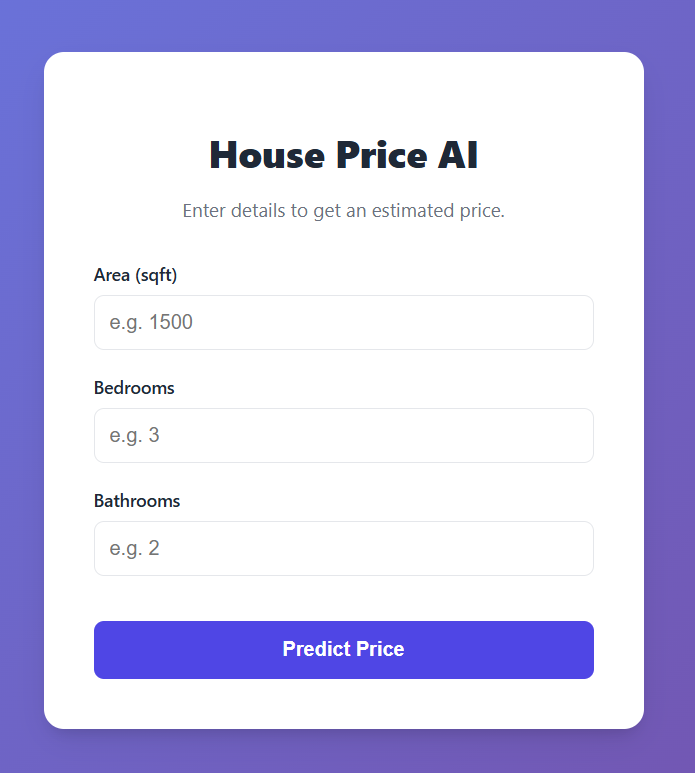
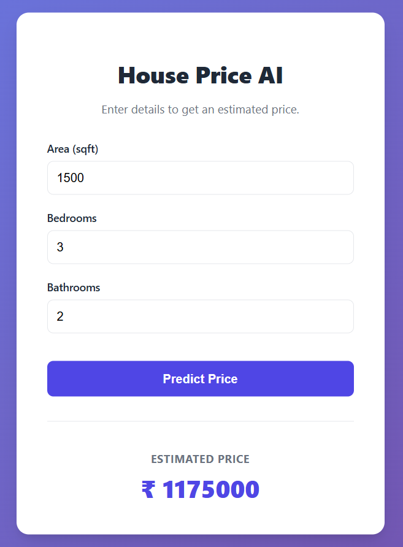

# 🏠 AI House Price Prediction

An AI-powered full-stack web application that predicts house prices based on property features using a Machine Learning regression model. The application provides instant price estimation through a clean React interface connected to a Flask backend.

---

## ✨ Features

- 🏠 House Price Prediction
- 🤖 Machine Learning Regression Model
- 📊 Real-time Price Estimation
- ⚡ Fast React Frontend
- 🔗 Flask REST API
- 📈 Instant Prediction Results
- 📱 Responsive UI
- 💰 Price Estimation Dashboard

---

# 📸 Screenshots

## Prediction Form



---

## Prediction Result



---

## 🛠 Tech Stack

### Frontend

- React.js
- Vite
- HTML
- CSS
- JavaScript

### Backend

- Python
- Flask

### Machine Learning

- Scikit-learn
- Pandas
- NumPy

---

## 📂 Project Structure

```
AI_ML_HOUSE_PRICE_PRED
│
├── backend
│   ├── app.py
│   ├── train_model.py
│   ├── model.pkl
│   ├── house_data.csv
│   └── requirements.txt
│
├── frontend
│   ├── src
│   ├── public
│   └── package.json
│
├── screenshots
│   ├── home.png
│   └── result.png
│
└── README.md
```

---

## 🚀 Installation

Clone the repository

```bash
git clone https://github.com/ARADHYA200/AI_ML_HOUSE_PRICE_PRED.git
```

Backend

```bash
cd backend
pip install -r requirements.txt
python app.py
```

Frontend

```bash
cd frontend
npm install
npm run dev
```

---

## 📊 Model Inputs

- Area (sqft)
- Number of Bedrooms
- Number of Bathrooms

---

## 🔮 Future Improvements

- Location-based prediction
- Interactive price charts
- Model comparison
- Advanced feature engineering
- Property recommendation system
- Model retraining dashboard

---

## 👨‍💻 Author

**Aradhya Agarwal**

GitHub: https://github.com/ARADHYA200

---

## ⭐ If you like this project, consider giving it a Star!